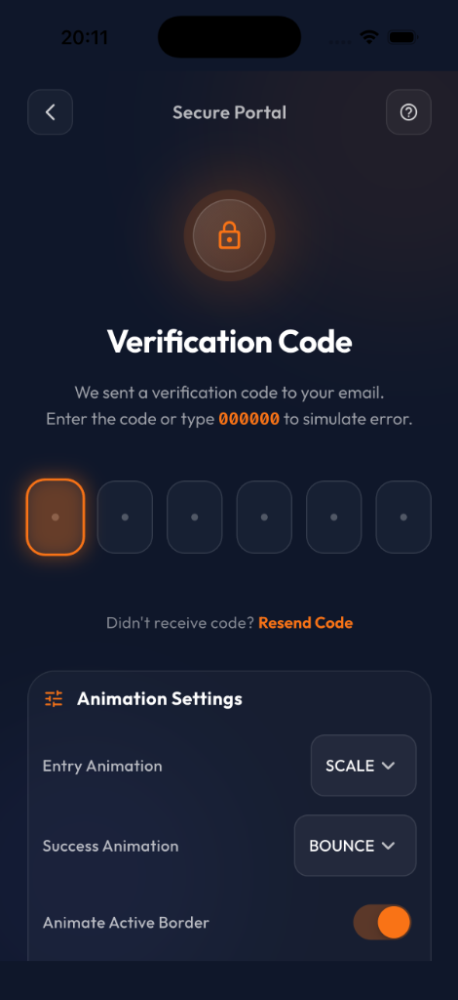
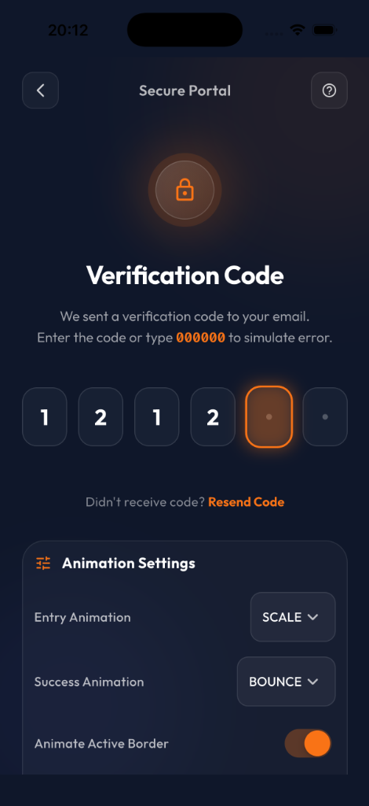
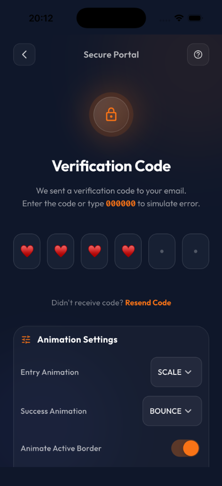

# Premium OTP Input

A highly customizable, beautiful, and interactive OTP (One-Time Password) / PIN entry widget for Flutter. It features rich visual aesthetics, micro-animations, verification loaders, error/success states, and optional security (obscure text) masking.

[](https://youtube.com/shorts/S8hR8s3T9L8)

## Preview

| Empty State | Input State | Obscured (Dot) | Obscured (Star) | Obscured (Heart) |
| :---: | :---: | :---: | :---: | :---: |
|  |  |  |  |  |

## Features

- **Rich Micro-Animations**: Smooth scale/fade/slide transitions on digit entry, active cursor border highlight, and box focus scaling.
- **Customizable Animation Styles**:
  - Choose between `scale`, `fade`, `slide`, or `none` for digit entry.
  - Choose between `bounce`, `scale`, `fade`, or `none` for the success screen transition.
- **Secure Obscuring / PIN Mode**: Easily hide/obscure typed characters with customizable obscuring characters (`●`, `*`, etc.).
- **Dynamic States**: Built-in verification loading indicators, error styling, and success checks (complete with checkmark drawing animations).
- **Extensively Customizable**: Adjust colors, borders, borderRadius, font styles, dot sizes, padding, spacing, and sizes.

---

## Getting Started

Add the package dependency to your `pubspec.yaml`:

```yaml
dependencies:
  premium_otp_input:
    path: ../premium_otp_input # Use local path or package name when published
```

---

## Usage

Here is a quick example showing the options in action, including customizable animations and obscuring text:

```dart
import 'package:flutter/material.dart';
import 'package:premium_otp_input/premium_otp_input.dart';

class OtpScreen extends StatefulWidget {
  const OtpScreen({super.key});

  @override
  State<OtpScreen> createState() => _OtpScreenState();
}

class _OtpScreenState extends State<OtpScreen> {
  final TextEditingController _otpController = TextEditingController();
  final FocusNode _otpFocusNode = FocusNode();
  
  bool _isVerifying = false;
  bool _isSuccess = false;
  bool _isError = false;

  void _handleOtpCompleted(String value) async {
    setState(() => _isVerifying = true);
    
    // Simulate server verification delay
    await Future.delayed(const Duration(seconds: 2));
    
    if (value == "123456") {
      setState(() {
        _isVerifying = false;
        _isSuccess = true;
      });
    } else {
      setState(() {
        _isVerifying = false;
        _isError = true;
      });
    }
  }

  @override
  Widget build(BuildContext context) {
    return Scaffold(
      backgroundColor: const Color(0xFF0F172A),
      body: Center(
        child: Padding(
          padding: const EdgeInsets.all(24.0),
          child: PremiumOtpInput(
            length: 6,
            controller: _otpController,
            focusNode: _otpFocusNode,
            isSuccess: _isSuccess,
            isError: _isError,
            isVerifying: _isVerifying,
            onCompleted: _handleOtpCompleted,
            
            // Security / PIN obscuring configuration
            obscureText: true,
            obscuringCharacter: '●', // You can use '●', '*', '★', '♥', etc.

            // Customizable Animations
            entryAnimationStyle: OtpEntryAnimationStyle.scale,      // scale, fade, slide, none
            successAnimationStyle: OtpSuccessAnimationStyle.bounce, // bounce, scale, fade, none
            animateActiveBorder: true,                              // Slide & scale focus indicator
            
            // Premium aesthetics custom styling
            boxHeight: 64.0,
            spacing: 12.0,
            borderRadius: 16.0,
            activeBorderColor: const Color(0xFFF97316),
            defaultBorderColor: Colors.white.withOpacity(0.12),
            successColor: const Color(0xFF22C55E),
            errorColor: const Color(0xFFEF5350),
          ),
        ),
      ),
    );
  }
}
```

---

## Configuration Properties

| Parameter | Type | Default | Description |
| :--- | :--- | :--- | :--- |
| `length` | `int` | `6` | Number of OTP input boxes. |
| `onChanged` | `ValueChanged<String>?` | `null` | Callback triggered whenever text changes. |
| `onCompleted` | `ValueChanged<String>?` | `null` | Callback triggered when all input boxes are filled. |
| `isSuccess` | `bool` | `false` | Switches view to completed success checkmark state. |
| `isError` | `bool` | `false` | Highlights input boxes with error color border. |
| `isVerifying` | `bool` | `false` | Triggers active loading border progress painter. |
| `obscureText` | `bool` | `false` | Enables obscuring of characters. |
| `obscuringCharacter`| `String` | `'●'` | The mask character used when `obscureText` is true. |
| `entryAnimationStyle`| `OtpEntryAnimationStyle`| `OtpEntryAnimationStyle.scale` | Animation style for digits (`scale`, `fade`, `slide`, `none`). |
| `successAnimationStyle`| `OtpSuccessAnimationStyle`| `OtpSuccessAnimationStyle.bounce` | Completed state transition animation style (`bounce`, `scale`, `fade`, `none`). |
| `animateActiveBorder`| `bool` | `true` | Enables/disables scale-up transitions and active cursor highlight slide animations. |
| `boxHeight` | `double` | `64.0` | Height of individual boxes. |
| `borderRadius` | `double` | `16.0` | Roundness of input boxes. |
| `spacing` | `double` | `12.0` | Spacing gap between input boxes. |
| `defaultBorderColor` | `Color` | `white12` | Unfocused box border color. |
| `activeBorderColor` | `Color` | `Orange (0xFFF97316)` | Focused box border color. |
| `successColor` | `Color` | `Green (0xFF22C55E)` | Completed success state color. |
| `errorColor` | `Color` | `Red (0xFFEF5350)` | Error state border color. |
| `boxBackgroundColor` | `Color` | `slate800` | Fill color for the input boxes. |
| `loadingBorderColor` | `Color` | `Orange` | Circular border loader color during verification. |
| `emptyDotColor` | `Color` | `white24` | Default color of placeholders for empty digits. |
| `emptyDotSize` | `double` | `6.0` | Diameter of the placeholder empty dot. |
| `textStyle` | `TextStyle?` | `GoogleFonts.outfit` | Custom text styling for entered digits. |
